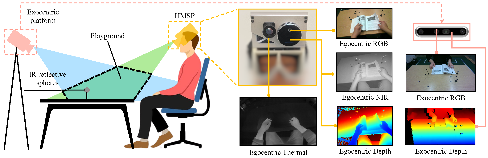
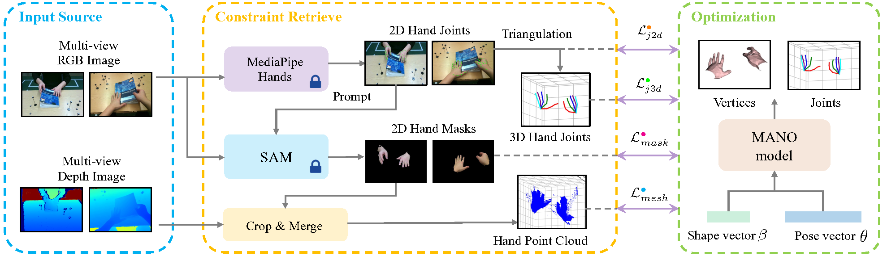

<div align="center">  
 
# ThermoHands: A Benchmark for 3D Hand Pose Estimation from Egocentric Thermal Images
</div>

<div align="center">  

[](https://arxiv.org/abs/2403.09871) 
[](https://www.youtube.com/watch?v=-oXKspAEyhg)
[](LICENSE) [](https://thermohands.github.io/) [](https://drive.google.com/file/d/1cXgnQEnZr-nx0LBa5mrn5-NXOp_QcL68/view) [](https://drive.google.com/file/d/1-tJiEXXzvqRSZiqOMqgHw0gMFAu6tlt5/view)


</div>

<p align="center">

</p>


This is the official repository of the **ThermoHands**, the first benchmark focused on thermal image-based egocentric 3D hand pose estimation. 
For technical details, please refer to our paper on ACM Sensys 2025:

**ThermoHands: A Benchmark for 3D Hand Pose Estimation from Egocentric Thermal Images**
<br/>
[Fangqiang Ding<sup>1,*</sup>](https://toytiny.github.io/), [Yunzhou Zhu<sup>2,*</sup>](https://lawrencez22.github.io/), [Xiangyu Wen<sup>1</sup>](https://ericwen2001.github.io/), [Gaowen Liu<sup>3</sup>](https://yimingli-page.github.io/), [Chris Xiaoxuan Lu<sup>4,†</sup>](https://christopherlu.github.io/)
<br/>
[[arXiv]](https://arxiv.org/abs/2403.09871) [[page]](https://thermohands.github.io/) [[demo]](https://www.youtube.com/watch?v=-oXKspAEyhg) [[data-a]](https://drive.google.com/file/d/1cXgnQEnZr-nx0LBa5mrn5-NXOp_QcL68/view) [[data-b]](https://drive.google.com/file/d/1-tJiEXXzvqRSZiqOMqgHw0gMFAu6tlt5/view) 
<br/>
<sup>1</sup>University of Edinburgh, <sup>2</sup>Georgia Institute of Technology, <sup>3</sup>Cisco, <sup>4</sup>UCL
<br/>
*Equal contribution, †Corresponding author


## 🔥 News
- [2024-02-27] Our preprint paper is available on 👉[arXiv](https://arxiv.org/abs/2403.09871).
- [2024-08-26] Our automatic annotation pipeline code is uploaded. 
- [2025-02-24] Our paper is accepted by [Sensys 2025](https://sensys.acm.org/2025/) (acceptance rate≈18%)🎉.
- [2025-03-24] Our TherFormer baseline code is uploaded. Stay tuned for update👀!
  
## 🔗 Citation
If you find our work helpful to your research, please consider citing:

```shell
@InProceedings{Ding_2025_Sensys,
  title={ThermoHands: A Benchmark for 3D Hand Pose Estimation from Egocentric Thermal Images},
  author={Ding, Fangqiang and Zhu, Yunzhou and Wen, Xiangyu and and Liu, Gaowen and Lu, Chris Xiaoxuan},
  booktitle={23rd ACM Conference on Embedded Networked Sensor Systems (Sensys)},
  year={2025}
}
```
## 📝 Abstract 
Designing egocentric 3D hand pose estimation systems that can perform reliably in complex, real-world scenarios is crucial for downstream applications. Previous approaches using RGB or NIR imagery struggle in challenging conditions: RGB methods are susceptible to lighting variations and obstructions like handwear, while NIR techniques can be disrupted by sunlight or interference from other NIR-equipped devices. To address these limitations, we present ThermoHands, the first benchmark focused on thermal image-based egocentric 3D hand pose estimation, demonstrating the potential of thermal imaging to achieve robust performance under these conditions. The benchmark includes a multi-view and multi-spectral dataset collected from 28 subjects performing hand-object and hand-virtual interactions under diverse scenarios, accurately annotated with 3D hand poses through an automated process. We introduce a new baseline method, TherFormer, utilizing dual transformer modules for effective egocentric 3D hand pose estimation in thermal imagery. Our experimental results highlight TherFormer's leading performance and affirm thermal imaging's effectiveness in enabling robust 3D hand pose estimation in adverse conditions.

## 📦 Method

|  | 
|:--:| 
| <div align="left">***Figure 1. Data capture setup.** We develop a customized head-mounted sensor platform (HMSP) and an exocentric platform to record multi-view multi-spectral data. During the capture, our participants are asked to perform predefined hand-object and hand-virtual interaction actions within the playground above the table.*</div> |

|  | 
|:--:| 
| <div align="left">***Figure 2. Automatic annotation pipeline.** We utilize the multi-view RGB and depth images as the input source and retrieve constraint information with off-the-shelf MediaPipe Hands and SAM. Various error terms are formulated to optimize the MANO parameters to obtain the 3D hand pose annotation.*</div> |

|  | 
|:--:| 
| <div align="left">***Figure 3. Overall frawework of TherFormer.** Backbone features are input to the mask-guided spatial transformer and temporal transformer to enhance the spatial representation and temporal interaction. Spatio-temporal embeddings are fed into the pose head to regress the 3D hand pose.*</div> |

## 🏞️ Visualization

Please see more visualization in our [demo video](https://www.youtube.com/watch?v=-oXKspAEyhg) and [project page](https://thermohands.github.io/).

### 3D Hand Pose Annotation

This video shows an example of 3D hand pose annotations. We show the left (blue) and right (red) hand 3D joints projected onto RGB images. From the same viewpoint, we also visualize the corresponding hand mesh annotation.


### Qualitative Results (main)

This part shows qualitative results for different spectra under the well-illuminated office (main) setting. 3D hand joints are projected onto 2D images for visualization. Ground truth hand pose is shown in green while the prediction results in blue.

 &nbsp;


### Qualitative Results (auxiliary)

Qualitative results for thermal vs. RGB (NIR) under our four auxiliary settings, including the glove, darkness, sun glare and kitchen scenairos. We show the left (blue) and right (red) hand 3D joints projected onto 2D images.

#### Glove 

 &nbsp;


#### Darkness

 &nbsp;


#### Sun glare & Kitchen

 &nbsp;


## 🚀 Getting Started

### Dataset Download

Our full dataset is splited into two parts: the main part is collected under the well-illumiated office setting, while the auxiliary part is obtained under our four challenging settings.

- Main part - [[Download link]](https://drive.google.com/file/d/1cXgnQEnZr-nx0LBa5mrn5-NXOp_QcL68/view?usp=drive_link)

- Auxiliary part - [[Download link]](https://drive.google.com/file/d/1-tJiEXXzvqRSZiqOMqgHw0gMFAu6tlt5/view?usp=drive_link)

After downloading, the dataset directory structure should look like this:

```
${DATASET_ROOT}
|-- egocenctirc
|   |-- subject_01
|   |   |-- cut_paper
|   |   |   |-- rgb
|   |   |   |-- depth
|   |   |   |-- gt_info
|   |   |   |-- thermal
|   |   |   |-- ir
|   |   |-- fold_paper
|   |   |-- ...
|   |   |-- write_with_pencil
|   |-- subject_01_gestures
|   |   |-- tap
|   |-- ...
|   |-- subject_02
|-- exocentric

```
where, for the same subject, we place hand-object interaction actions into subject_xx folder while hand-virtual interaciton actions into subject_xx_gestures folder. Data captured from the egocentric and exocentric view is stored seperately. 

If you would like to use our calibration information for further development, please refer to our [calibration](/calibration/) folder.

### Installation 
We test our code in following enviroment:
```
Ubuntu 20.04
python 3.9
pytorch 2.2.0
CUDA 11.8
```
Please install pytorch compatible to your device according to offical pytorch web page.
Other packages can be install via pip:
```
cd TherFormer
pip install -r requirements.txt
```
Our code also depends on libyana and DAB-DETR:
```
pip install git+https://github.com/hassony2/libyana@v0.2.0
cd models/dab_deformable_detr/ops
python setup.py build install
```
### TherFormer baseline
We follow [HTT](https://github.com/fylwen/HTT) to use lmdb during training, thus data prepocessing is required before the training. Please refer to [make_lmdb.py](https://github.com/LawrenceZ22/ThermoHands/blob/main/TherFormer/make_lmdb.py) as an example.

To train the therformer-V for thermal images:
```
cd TherFormer
python train_baseline.py --dataset_folder [your_data_folder] --cache_folder [you_workspace_path] --train_dataset thermal
```
Simliarly, to train the model for IR images:
```
python train_baseline.py --dataset_folder [your_data_folder] --cache_folder [you_workspace_path] --train_dataset thermal_ir --experiment_tag THEFomer_ir
```

For the non-video version, please set  both the "--ntokens_pose" and "--ntokens_action" to 1.


## 🔧 Automatic Hand Pose Annotation
Besides our baseline code, we also release our self-developed automatic hand pose annotation tools in [thermohands-annotator](/thermohands-annotator/). You can use this code to generate the 3D hand pose annotations for your own data. 

> Note: our automatic annotation method is designed for two-view settings and demand depth and RGB image capture from each view, as well as camera calibrations. However, you can modify our code to fit your own settings if necessary.

First of all, please organize your capture data into the directory structure like this:

```
${DATA_ROOT}
|-- calibration
|   |-- ego_calib.json
|   |-- exo_calib.json
|-- subject_01
|   |-- cut_paper
|   |   |-- egocentric
|   |   |   |-- depth
|   |   |   |   |-- 1707151988183.png 
|   |   |   |   |-- ...
|   |   |   |-- ir
|   |   |   |   |-- 1707151988183.png 
|   |   |   |   |-- ...  
|   |   |   |-- rgb
|   |   |   |   |-- 1707151988183.png 
|   |   |   |   |-- ...  
|   |   |   |-- thermal
|   |   |   |   |-- 1707151988186334431.tiff 
|   |   |   |   |-- ...  
|   |   |-- exocentric
|   |   |   |-- depth
|   |   |   |-- rgb
|   |-- fold_paper
|   |   |-- egocentric
|   |   |-- exocentric
|   |-- ...
|-- subject_02
|-- ...
```

where `ego_calib.json` stores the camera instrinsic and extrinsic for the egocentric platform while `exo_calib.json` for the exocentric platforms. Please refer to our [calibration](/calibration/) folder.

Second, install all libraries our used tools by the following command (an independent conda environment is recommended):

```
pip install -r requirements.txt
```

Also, download the Segment-Anything pretrained model from [here](https://dl.fbaipublicfiles.com/segment_anything/sam_vit_l_0b3195.pth) and save as `\sam\sam_vit_l_0b3195.pth`.

Then, run our pipeline code for automatic 3D hand pose annotation by the following command:

```
cd thermohands-annotator
python pipeline.py \
    --subs 01 18 25 \ # replace with your own subject indices 
    --root_dir /path/to/data \ # where you place the data capture
    --save_dir /path/to/output # where you save the annotation output
```
Our pipeline contains 7 steps:

1. Visualize all capture data and save their images
2. Infer point cloud from ego depth image and run KISS-ICP to obtain the odometry
3. Annotate markers for the first frames and calculate the transformation between two views. This step demands the graphical interface for marker labelling. Please label the marker in the same order from two views.
4. Infer 2D hand pose and mask, infer 3D hand pose and hand point cloud
5. Optimize the 3D hand pose by fitting MANO model
6. Generate 2D mask ground truth based on hand pose ground truth
7. Make annotation movies

You can use `state_dataset.py` to summarize your dataset and  `th2player.py` to visualize the 3D hand mesh. Make proper modification to these files' path parameters to adapt to your own dataset.


## Acknowledgement

Many thanks to these excellent projects:

- [HTT](https://github.com/fylwen/HTT)
- [Segment-anything](https://github.com/facebookresearch/segment-anything)
- [Mediapipe](https://github.com/google-ai-edge/mediapipe/tree/master)
- [Manopth](https://github.com/hassony2/manopth)
  
